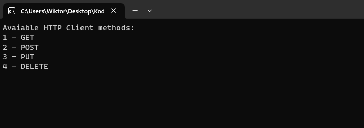

# Books API Management Application
This C# application is designed to manage a collection of books through two projects: [Books API](#books-api "Books API") and [Books Client API](#books-client-api "Books Client API")

## Books API 
The Books API is a web service built using C# and ASP.NET Core. It provides a set of RESTful endpoints to perform **CRUD** (Create, Read, Update, Delete) operations on a collection of books. These endpoints include:

* GET `/api/books` Retrieve a list of all books.
* GET `/api/books/{id}` Retrieve a specific book by its unique identifier.
* POST `/api/books` Create a new book entry.
* PUT `/api/books/{id}` Update the details of a book using its unique identifier.
* DELETE `/api/books/{id}` Delete a book from the collection.

The API project runs on `https://localhost`. It has also configured Swagger which ensure a RESTful API documentation with all of available endpoint and allow testing them. 

### GET response results in Swagger:
```json
[
  ...
  {
    "id": 2,
    "title": "Lord of The Rings",
    "author": "J.R.R. Tolkien",
    "description": "string",
    "genre": "Comedy",
    "publishDate": "2023-09-06T20:56:35.85Z"
  },
  {
    "id": 3,
    "title": "Królewna śnieżka",
    "author": "Hans Christian Andersen",
    "description": "Książka dla małych dzieci",
    "genre": "Bajka",
    "publishDate": "2023-09-13T20:28:01.727Z"
  },
  ...
]
```

## Books Client API
The Books Client API is a console application that interacts with the Books API to manage the collection of books. It allows users to perform the following actions from the command line as shown below:



By entering proper option user can test API with console as well as using Swagger.

### GET response results using client console:
```
Id: 2
Titile: Lord of The Rings
Author: J.R.R. Tolkien
Description: string
Genre: Comedy
Publish Date: 06.09.2023 20:56:35

Id: 3
Titile: Królewna śnieżka
Author: Hans Christian Andersen
Description: Książka dla małych dzieci
Genre: Bajka
Publish Date: 13.09.2023 20:28:01
```

### Database Configuration
The application utilizes PostgreSQL as the database system and Entity Framework Core for database access and management. The *appsettings.json* file contains the configuration of the connection to the PostgreSQL database:

```json
...
"AllowedHosts": "*",
  "ConnectionStrings": {
    "EF_Postgres_Db_conn": "Server=localhost;Database=[database_name];Port=5432;User Id=postgres;Password=[password];"
  }
...
```
With using Dependency Injection in the *Program.cs* the book context is configured to connect to a PostgreSQL:

```csharp
builder.Services.AddDbContext<BookDbContext>(options =>
    options.UseNpgsql(builder.Configuration.GetConnectionString("EF_Postgres_Db_conn")));
```

### Dependecies
* Visual Studio
* NET Core
* PosrgreSQL
* EntityFramework

### Getting Started
To use this application, follow these steps:

1. Clone the repository to your local machine.
2. Set up a PostgreSQL database and update the connection string in the configuration.
3. Build and run the Books API project to start the web service.
4. Run the Books Client API console application to interact with the API.
* or in the Soulution Explorer options it can be possible to run both project simultanously. *Solution Explorer -> Properties -> Startup Project -> click both project to 'Start'*
